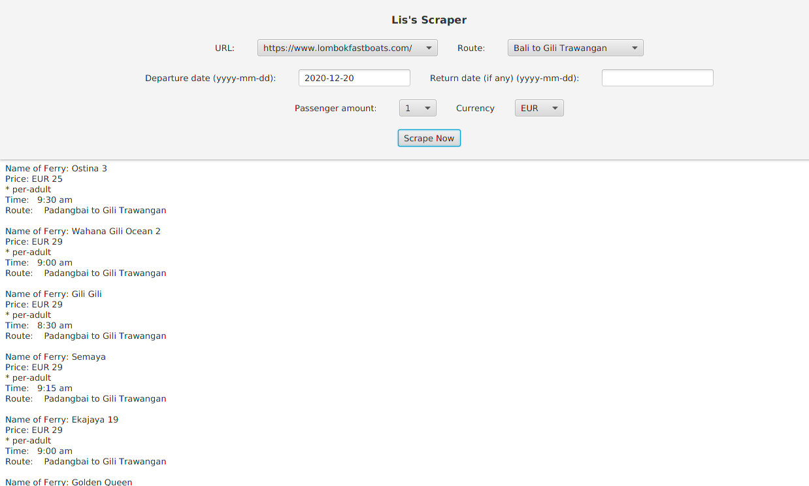

# Webscraping Project
<strong>Warning, strong amateur project title</strong>
<h2>DESCRIPTION</h2>

 A personal project sample, one sample taken from the project used in my previous office. I used to compare prices between websites and retrieved their ferry prices and stored it in excel documents, usually this process took me from 9am to 2.30pm, but with the scraper, it only took me about 1 hour or less to retrieve prices from different websites and manually stored it in excel. However this project was private and i replicated one sample and enhanced it by adding gui.

 

The Gui looks like this:

 

 
<h2> FUTURE PROJECT </h2>

 There are possible advancements towards fixing this project, such as:

<ul>
<li>Prettifying the codes</li>
<li>Separating classes into different folder to make the relationship between classes clearer</li>
<li>Adding documentation to explain how each classes relates to one another</li>
</ul>
